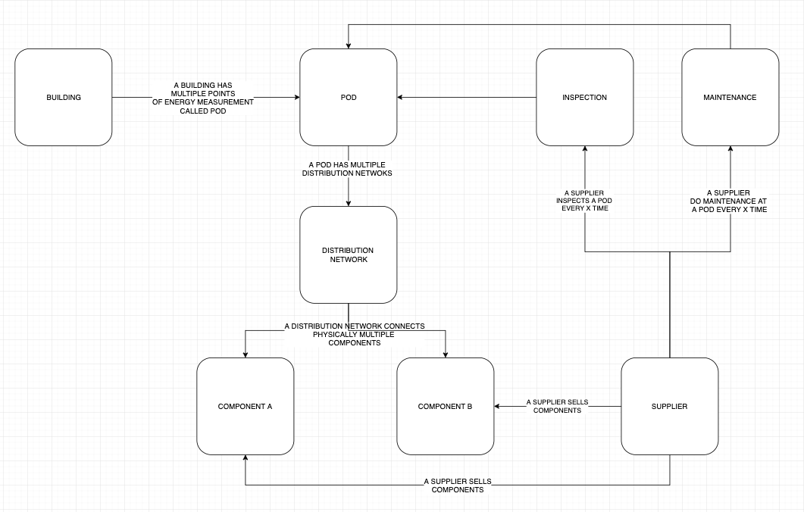

# Serverless API 

## 1. Background Info

- we use AWS Serverless for our functionalities with dynamodb as Datastore and API Gateway 
- the implementation of pure Reads and Writes to/ from DynamoDB with API Gateway are being done using VLT (Velocity Template Language) and custom integration
- our intention is to avoid creating lambdas when not needed
- for any other action we use Lambdas with nodejs as runtime (machine learning aside)
- all our deployments are Cloudformation based, we dont deploy Resources via Console
- we dont allow for the Use of Serverless Framework or Terraform
- the stacks are being launched using AWSCLI Commands and later on automated with Makefiles


## Goal

- create a full API using the following technologies
  -  DynamoDb, 
  - DynamoDB Streams, 
  - Swagger, 
  - Lambda Functions, 
  - VTL, 
  - EMR, 
  - API Gateway 
  - Cognito.

- this assignment is intended to test general development skills we employ using the following technologies supporting serverless development

  

## 2. Scope of delivery

| __Results__              | __Description__                                              |
| ------------------------ | ------------------------------------------------------------ |
| Documentation            | A documentation describing the resources and the approach as well as the elaborations on the lambda/ nodejs code |
| Cloudformation templates | Cloudformation templates with the resources working as expected in an automated way |
| Lambda Functions | A folder with all the lambda functions |
| API | the APIs must be ready to be tested using the AWS Console |
| Global Makefile | A Makefile that automates the creation of the Cloudformation Stacks. It should execute step by step every stack, waiting till its complete before moving to the next stack. It also needs to cover all the S3 uploads, for the case of lamba resources. |


## 3. Details of the assignment

- The assignment will be separated into different milestones. 
- Every milestone needs to be implemented and tested before moving to the next milestone. 
- This will allow us to have a proper track of the work being developed.

### 3.1 Constraints

- All Cloudformation stacks must use YAML format

- Split the stacks when needed. For example, if a API Gateway resource needs a domain, roles, and s3 buckets before, be sure that these are implemented in separate stacks. Use the import/export functionalities from Cloudformation to achieve this goal.

- Document all the steps needed to deploy the stacks on our environment. 

- The test will only be approved once working in our environment. 

- That's why we strongly suggest to focus on automation, **avoiding hardcoded values** from AWS-Account and AWS-Region inside your stacks. Think that it will run in several environments.

- Nodejs 8.10 and Typescript should be used for all the lambdas, except the ones that are related to Machine Learning or Big Data purposes. 

- In that case, python should be used

  

## 4. Milestones

### 4.1 Milestone 1: DynamoDB table design

- the first milestone is to set up the dynamodb with the appropriate GSIs
- please provide the respective Cloudformation stack 
- we provide the sample data
- the following image shows the relations to consider in the table design
- you see the following item groups:
  - building
  - POD
  - Inspection
  - Maintainance
  - Distribution Network
  - Component A
  - Component B
  - Supplier



- please provide a table design first matching such a pattern (best as goggle sheet)


### 4.2 Milestone 2: DynamoDB Table setup

- once we approved the design please model the DynamoDB table in accordance with those relations to fit the following Access Patterns

| __Table__ | __Access Pattern__ |
| ------------------------ | ------------------------------------------------------------ |
| BUILDING | Create a building |
| BUILDING | Create POD for an existing building |
| POD | List all Distribution networks of a POD |
| POD | List all inspections of a POD sorted by Date |
| POD | List all maintenances of a POD sorted by Date |
| POD | Query which building a POD belongs to |
| POD | Remove POD from building |
| DISTRIBUTION NETWORK | List all components of a distribution network |
| DISTRIBUTION NETWORK | Create a distribution network for a POD |
| SUPPLIER | List all components sold by a supplier |
| SUPPLIER | Remove Supplier |
| COMPONENT | Query the info of the supplier that sold component A |
| COMPONENT | Create a component for a distribution network, sold by a supplier X |
| COMPONENT | Remove component from distribution network |


### 4.2 Milestone 3: API Gateway

- After creating the DynamoDb Table, set up the APIs Integration
- to integrate the dynamodb Backend with API Gateway use a custom integration for any pure READ/ WRITE action
- An example of this integration can be found [here](https://aws.amazon.com/blogs/compute/using-amazon-api-gateway-as-a-proxy-for-dynamodb/).
- The language used to be used in the custom integration is Velocity Template Language (VTL)
- Further information can be found [here](https://docs.aws.amazon.com/apigateway/latest/developerguide/api-gateway-mapping-template-reference.html) and [here](http://velocity.apache.org/engine/1.7/vtl-reference.html).

- there shall be one API gateway for each particular path (subdomain) 
  - `/building`
  - `/pod`
  - `/dist_network`
  - `/supplier`
  - `/component`
  - `/inspection`
  - `/maintenance`

- please use  `BasePathMapping` which is a technique used by AWS that allows for having multiple separated APIS pointing to the same domain 

- That way, I can have multiple apis, all being accessed from the same domain, as follows: 
  - `www.mydomain.com/api/v1/building`
  - `www.mydomain.com/api/v1/pod`
  - `www.mydomain.com/api/v1/dist_network`
  - etc.

- every api must have its own cloudformation stack, swaggerfile, and when needed, lambda function.

- any api must be secured using a Cognito Authorizer with the Google Federated Entity
- Be sure to include the security definition inside your swagger files (sample): 

```yaml
securityDefinitions:
  Lambdaauthorizer:
    type: apiKey # Required and the value must be "apiKey" for an API Gateway API.
    name: Authorization # The name of the header containing the authorization token
    in: header # Required and the value must be "header" for an API Gateway API.
    x-amazon-apigateway-authtype: cognito_user_pools # Specifies the authorization mechanism for the client.
    x-amazon-apigateway-authorizer: # An API Gateway Lambda authorizer definition
      type: cognito_user_pools # Required property and the value must "token"
      providerARNs:
      - ${replace_with_cognito_use_pool_ARN} # Be sure to use Fn::ImportValue instead of hardcoding values
```


### 4.3 Milestone 4: Frontend

- Create UI views using Vue.js.

- Create simple views with forms to visualize the information mentioned in the access patterns

  

## 5. Provided by us

- General guidance
- Github Repository to pull from 


## 6. Compensation

- the test is being compensated, if successful and delivered within the project term, with **500 USD**


## 7. Timeline

- Project Term: 2 weeks 
